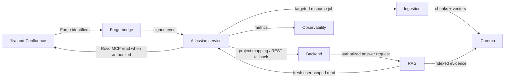
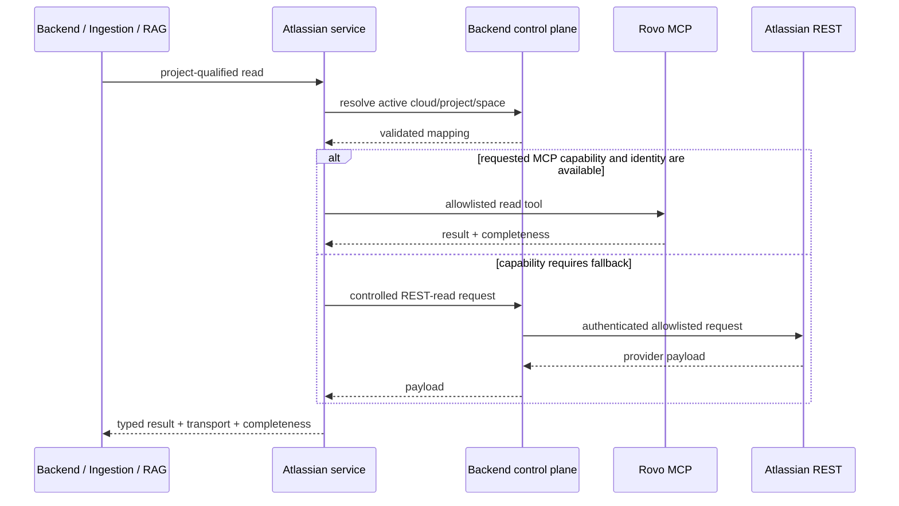

# Project Intelligence Atlassian — Current Architecture

The application suite has one active vector-record schema: version `3`. This provider boundary
does not select or write schema versions; it supplies authorized source material to ingestion,
which writes the single active contract.

Last verified against the repository code and active development topology: 2026-09-15.

## 1. Purpose and boundary

This service is the single Jira and Confluence provider boundary. It owns Atlassian transport,
identity-class separation, Forge event admission, provider capability policy, project/resource
resolution, catch-up coordination, and freshness. It does not parse documents, create embeddings,
write Chroma, own application authorization, or persist conversations.

The first release is strictly read-only. Startup rejects any configuration that enables writes,
the MCP client allowlists read tools, and the mutation endpoint always returns
`403 ATLASSIAN_WRITE_DISABLED`.

## 2. Five-project context



The active development path uses the controlled backend REST fallback. Rovo MCP and Forge code are
present but remain inactive until Atlassian authorization and Forge deployment are completed.

## 3. Component map

| Component | Responsibility |
|---|---|
| `app/main.py` | FastAPI lifecycle, internal authentication, health/freshness/capability APIs, event/search/session/fallback routes, and typed error translation |
| `app/config.py` | Environment contract, endpoints, size/time/concurrency limits, read-only startup invariant, project allowlist, and recovery cadence |
| `app/security.py` | Internal API-key checks, HMAC signature verification, timestamp window, replay protection, MCP tool allowlist, and mutation denial |
| `app/models.py` | Provider-neutral event, MCP search/result, session, callback, mutation, and REST-read contracts |
| `app/mcp.py` | Streamable HTTP JSON-RPC initialization and allowlisted Rovo MCP tool calls for service or user identities |
| `app/coordinator.py` | Project catalog cache, cloud/resource mapping, event dedupe and two-second parent coalescing, targeted dispatch, retry, recovery scans, and freshness state |
| `app/telemetry.py` | Content-free counters and histograms for events, MCP calls, dispatch, catch-up, and pending work |
| `forge/manifest.yml` | Read-only Jira and Confluence event subscriptions and bridge permissions |
| `forge/src/index.js` | Converts Atlassian events to the identifier-only contract and signs the outbound delivery |
| `scripts/register_ngrok_callback.py` | Reads the local ngrok tunnel and registers the callback URL through the service |

## 4. Identity and authorization

There are two separate MCP identity classes:

- `SERVICE` is a read-only ingestion identity for complete scans and refreshes.
- `USER` is an ephemeral, project-qualified user session for live RAG verification.

The backend remains authoritative for application projects and membership. The Atlassian service
loads only active mappings and validates cloud ID plus Jira project key or Confluence space ID.
It never broadens a project and never substitutes `SERVICE` when a user session is missing.

Durable OAuth refresh tokens stay in the backend secret store. User session access tokens are held
in process memory, expire, and are removed through the internal session API. Internal callers use a
separate service credential.

## 5. Read flow



REST fallback is reserved for unsupported MCP capabilities, complete pagination, attachment
binaries, and deletion verification. Every result states its transport and completeness.

## 6. Event-to-index flow

Forge sends identifiers and metadata, never source content. The service verifies the HMAC signature,
timestamp, payload bound, event ID, cloud, and configured resource. Duplicate event IDs are ignored;
events for the same parent are coalesced for two seconds.

```mermaid
sequenceDiagram
    participant F as Forge
    participant A as Atlassian service
    participant B as Backend catalog
    participant I as Ingestion
    participant C as Chroma
    F->>A: signed identifier-only event
    A->>A: verify, dedupe, coalesce
    A->>B: map cloud/resource to app project
    B-->>A: authorized mapping
    A->>I: targeted provider/resource ingestion
    I->>A: authoritative parent read
    I->>I: diff section manifests
    I->>C: upsert changed chunks; remove confirmed missing children
    I-->>A: checkpointed completion
```

Ingestion commits the resource checkpoint only after all required Chroma writes succeed. Metadata
updates do not regenerate unchanged embeddings. Deletion reconciliation requires either a confirmed
delete event or a complete authoritative read.

## 7. Offline recovery and freshness

Docker availability defines live event processing availability. On startup, and every five minutes,
the coordinator asks ingestion for incremental catch-up from the last successful cursor. A daily
authoritative inventory reconciliation detects missed or cascading deletions. A mapping becomes
`FRESH` only after catch-up succeeds; incomplete or failed work remains visible and retryable.

## 8. APIs

| Route | Caller | Purpose |
|---|---|---|
| `GET /v1/health` | probes/operators | Process liveness and read-only mode |
| `GET /v1/freshness` | RAG/operators | Per-project/provider catch-up state |
| `GET /v1/capabilities` | internal clients | Available read transports and disabled writes |
| `GET /metrics` | Prometheus | Content-free operational metrics |
| `POST /v1/events/atlassian` | Forge | Signed identifier-only event admission |
| `PUT /v1/forge/callback` | setup script | Register the current HTTPS callback |
| `POST /v1/internal/search` | backend/RAG/ingestion | Allowlisted Rovo read/search tool call |
| `POST /v1/internal/rest-read` | ingestion/RAG | Controlled fallback read through backend |
| `PUT/DELETE /v1/internal/sessions` | backend | Register/remove ephemeral user MCP session |
| `POST /v1/internal/mutations` | any internal caller | Always reject in this release |

## 9. Failure and retry behavior

- Invalid signatures, expired events, replay attempts, unconfigured clouds, and oversized payloads
  fail before dispatch.
- Authentication and authorization failures are never retried.
- Transient provider and ingestion failures use bounded exponential retry.
- A failed event remains recoverable through cursor catch-up.
- Missing user sessions return an authorization error; the service identity is not used as fallback.
- MCP unavailability may use REST only when policy permits and the result reports the fallback.

## 10. Observability and privacy

Metrics include accepted/duplicate/rejected event counts, dispatch latency, MCP calls by identity and
outcome, catch-up duration, and pending work. Logs and metrics exclude issue/page bodies, queries,
answers, tokens, authorization headers, signatures, and attachment content.

## 11. Development topology and activation

The backend Compose project builds this repository and exposes it at `127.0.0.1:8005`. Internally it
uses port `8000` on the shared application network. Backend, ingestion, and RAG call it by service
name. The observability stack probes health/freshness and scrapes `/metrics`.

Current activation status:

| Capability | Status |
|---|---|
| Service process, health, freshness, controlled REST fallback | Active |
| Targeted Jira/Confluence ingestion contract | Active |
| Read-only enforcement and mutation rejection | Active |
| Rovo MCP client and session interfaces | Implemented; authorization not activated |
| Forge app and signed event bridge | Implemented; registration/deployment/install not completed |
| Future write interfaces | Defined only; unavailable and disabled |

## 12. Non-negotiable invariants

1. The backend owns application authorization and durable Atlassian connections.
2. Ingestion is the only Chroma writer.
3. RAG uses user identity for live reads and indexed evidence for normal low-latency retrieval.
4. Events carry identifiers, never source content.
5. Reads are project-, cloud-, and resource-scoped.
6. Writes cannot be enabled by a request or MCP response.
7. A partial scan is never reported as complete or used for deletion reconciliation.
8. Credentials and provider content never enter telemetry.

Related architecture references:

- [Backend](../../project-intelligence-backend/docs/CURRENT_ARCHITECTURE.md)
- [Ingestion](../../project-intelligence-ingestion/docs/CURRENT_ARCHITECTURE.md)
- [RAG](../../project-intelligence-rag/docs/CURRENT_ARCHITECTURE.md)
- [Observability](../../project-intelligence-observability/docs/ARCHITECTURE.md)
